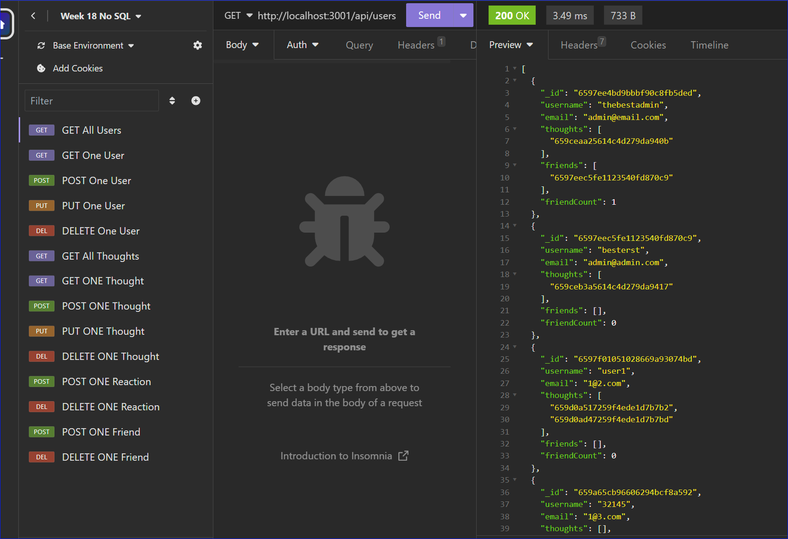
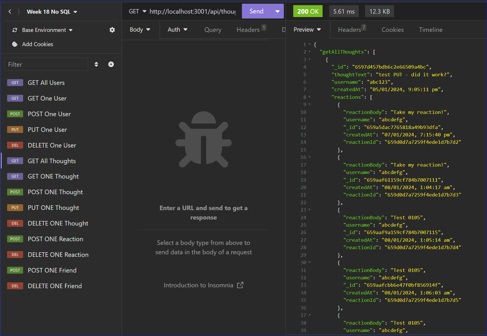

<a ID="readme-top"></a>

<div align="center">

# Huber's Social Network Server

[](https://opensource.org/licenses/MIT)
[](https://nodejs.org/en)
[](https://www.mysql.com/)
[](https://expressjs.com/)
[](https://www.mongodb.com/)
[](https://mongoosejs.com/)

Challenge 18 - No SQL (MongoDB)
</div>

## Description

Huber's social network server is designed on a MongoDB platform. Its purpose is to connect the front-end social network application

High level features of the server are to support:

* User management
* Enabling users to express their thoughts 
* Enabling other users to respond to thoughts with reactions
* Allowing users to connect and become friends with one another.

This server has been developed without starting code

## Table of contents


- [User Story](#user-story)
- [User Acceptance Critieria](#user-acceptance-criteria)
- [Installation](#installation)
- [Usage](#usage)
- [Video and Screenshots](#video-and-screenshots)
- [License](#license)
- [Contributing](#contributing)
- [Testing](#testing)
- [Technologies Used](#technologies-used)
- [Questions](#questions)

## User Story <a ID="user-story"></a>

This server was developed with this user story in mind:


```md
AS A social media startup
I WANT an API for my social network that uses a NoSQL database
SO THAT my website can handle large amounts of unstructured data
```

<p align="right">(<a href="#readme-top">back to top</a>)</p>

## User Acceptance Criteria

### This server was developed with the below User acceptance criteria:

```
GIVEN a social network API

WHEN I enter the command to invoke the application
THEN my server is started and the Mongoose models are synced to the MongoDB database

WHEN I open API GET routes in Insomnia for users and thoughts
THEN the data for each of these routes is displayed in a formatted JSON

WHEN I test API POST, PUT, and DELETE routes in Insomnia
THEN I am able to successfully create, update, and delete users and thoughts in my database

WHEN I test API POST and DELETE routes in Insomnia
THEN I am able to successfully create and delete reactions to thoughts and add and remove friends to a user’s friend list
```

### Additional requirements:

* Mongoose package must be used to connect to MongoDB database
* Express JS package must be used for routing


<p align="right">(<a href="#readme-top">back to top</a>)</p>

## Video and Screenshots

### Video

Watch these two videos to learn more about the server


<a href="https://drive.google.com/file/d/15-dXXBq0_j8XdnSx6tYZehKxHfb6CfhM/view"> Video - "Huber's Social Network Server" (10:52 min) </a>

<a href="https://drive.google.com/file/d/1Z0E57SvpZfY3E8IvAX_7hwZ1rNYaT_If/view"> Video - "Social Network Server - Delete thought when user is deleted" (1:02 min) </a>


### Screenshots

Screenshot of response to a GET request for all categories
<div align="center">


</div>

Screenshot of response to a GET request for all products
<div align="center">


</div>

<p align="right">(<a href="#readme-top">back to top</a>)</p>

## Installation

1. Clone or fork the repository
2. Run the below in console install necessary packages
    * Express 
    * Mongoose
    
```
npm i
```
3. Once installed you can start the server with the below command in the CLI:
```
npm run dev
```

<p align="right">(<a href="#readme-top">back to top</a>)</p>

## Usage

As this is purely a backend social-network server, utilise an API development platform like <a href="https://insomnia.rest/">Insomnia </a> to transmit API requests

Available APIs are as followeds

| Users                   | API                                      | 
| ----------------------- | ---------------------------------------- | 
| GET all users:          | http://localhost:3001/api/users/         | 
| GET one user:           | http://localhost:3001/api/users/:userId  | 
| POST one user:          | http://localhost:3001/api/users          | 
| PUT one user by ID:     | http://localhost:3001/api/users/:userId  | 
| DELETE one user by ID:  | http://localhost:3001/api/users/:userId  | 

Category POST/PUT sample JSON body:
```
{
	"username" : "User123",
	"email" : "User@email.com"
}
```
** GET ONE user will also obtain detail information about thoughts and reactions
** DELETE one user will also delete thoughts authored by that user

*** UP TO HERE ***

| Thoughts                  | API                                    		| 
| ------------------------- | --------------------------------------------- | 
| GET all thoughts:         | http://localhost:3001/api/thoughts/           | 
| GET one Thought by ID:    | http://localhost:3001/api/thoughts/:thoughtId | 
| POST one Thought          | http://localhost:3001/api/thoughts/    		|  
| PUT one Thought by ID:    | http://localhost:3001/api/thoughts/:thoughtId |
| DELETE one Thought by ID: | http://localhost:3001/api/thoughts/:thoughtId |

Thought POST/PUT sample JSON body:
 ```
{
	"thoughtText" : "What a lovely day today",
	"username" : "User123",
	"userId" : "659aba9d2cec9c8652e7b021"
}
 ```

| Reactions                  | API                                                                 |
| -------------------------- | ------------------------------------------------------------------- |
| POST one Reaction     	 | http://localhost:3001/api/thoughts/:thoughtId/reactions/            |
| DELETE one Reaction by ID: | http://localhost:3001/api/thoughts/:thoughtId/reactions/:reactionId |

Tag POST/PUT sample JSON body:
```
{
	"reactionBody" : "This is a wonderful thought!",
	"username" : "User234"
}
```
| Friends                    | API                                                       |
| -------------------------- | --------------------------------------------------------- |
| POST one Friend by ID      | http://localhost:3001/api/users/:userId/friends/:friendId |
| DELETE one Reaction by ID: | http://localhost:3001/api/users/:userId/friends/:friendId |

<p align="right">(<a href="#readme-top">back to top</a>)</p>
    
## License

[](https://opensource.org/licenses/MIT)

This application can be used in conjunction with licensing covered in  <b>MIT Lcensee</b>

(Click on the badge for details of the license)

<p align="right">(<a href="#readme-top">back to top</a>)</p>

## Contributing

To contribute to this application, please reach out to me via my contact details below

<p align="right">(<a href="#readme-top">back to top</a>)</p>

## Testing

Automated Test scripts have not been developed for this application

<p align="right">(<a href="#readme-top">back to top</a>)</p>

## Technologies used <a ID="technologies-used"></a>

* Javascript
* Node.js
* Node Package Manager (NPM)
* MongoDB
* Mongoose
* Express
* Insomnia

<p align="right">(<a href="#readme-top">back to top</a>)</p>

## Questions

- Visit my GitHub page: <a href="https://github.com/hybee234"> hybee234 </a>
  
<p align="right">(<a href="#readme-top">back to top</a>)</p>

